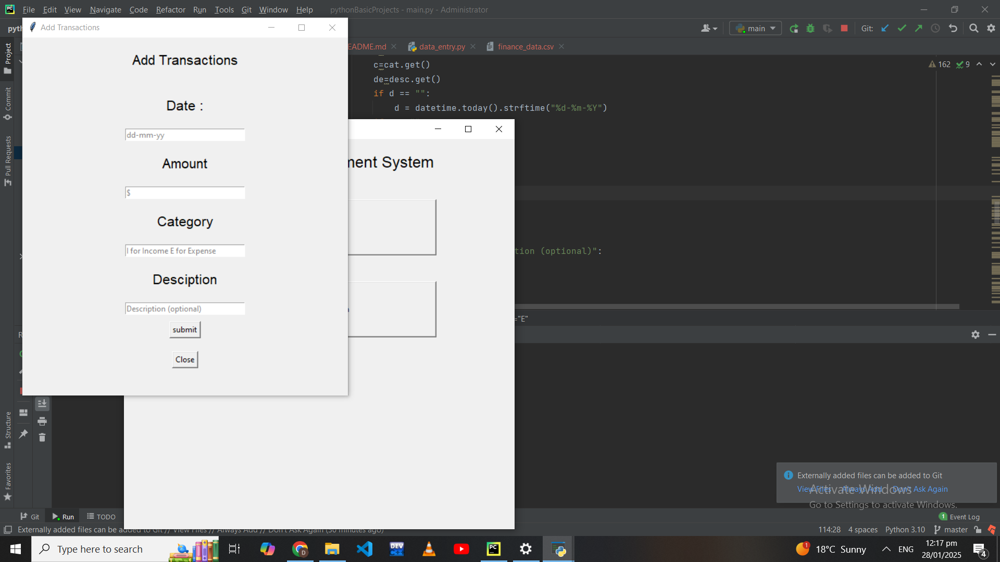

# Transaction Management System

## Overview
The **Transaction Management System** is a Python-based desktop application built using the Tkinter library. This application allows users to manage transactions, such as adding and viewing records of financial activities. It features a graphical user interface for user interaction and is suitable for small-scale personal or business use.

---

## Features
- **Add Transactions**: Users can input transaction details such as date, amount, and description.
- **View Transactions**: Displays a list of all stored transactions in a user-friendly table.

[comment]: <> (- **Delete Transactions**: Allows users to remove unwanted or incorrect transaction records.)
- **User-Friendly Interface**: Simple and clean GUI built using Tkinter.

---

## Prerequisites
Ensure you have the following installed on your system:

- Python 3.x
- Tkinter (comes pre-installed with Python)

---

## Installation

Follow these steps to set up the project in PyCharm:

1. **Clone or Download the Repository**:
   ```bash
   git clone https://github.com/dipanshupandey/pythonBasicProjects/tree/main/data_entry.git
   ```
   
   If you downloaded the ZIP, extract it into your desired directory.

2. **Open the Project in PyCharm**:
   - Launch PyCharm.
   - Open the folder containing the project files.

3. **Install Required Dependencies**:
   The project may use additional libraries. Install them using:
   ```bash
   pip install -r requirements.txt
   ```

   *(If `requirements.txt` is not included, Tkinter is enough for basic functionality.)*

4. **Run the Application**:
   - Locate the main Python file (e.g., `main.py`) in the project directory.
   - Right-click and select **Run 'main'** in PyCharm.

---

## File Structure
```
transaction-management-system/
├── main.py             # Main application file
├── README.md           # Project documentation
├── requirements.txt    # List of dependencies (if any)
├── assets/             # Images or other assets (if applicable)
└── modules/            # Additional Python modules for functionality
```

---

## Usage

1. **Launch the Application**:
   Run the `main.py` file in PyCharm.

2. **Add Transactions**:
   - Fill out the input fields (e.g., Date, Amount, Description) and click the "Add" button.

3. **View Transactions**:
   - Use the "View Transactions" button to display all stored records in a table.


---

## Screenshots

Add screenshots of your application's interface (optional):

1. **Main Window**:
   

2. **Add Transactions**:
   
3. **Fetch Transactions**:
   

---

## Technologies Used
- **Python**: Core programming language.
- **Tkinter**: GUI library for building the desktop application.

---

## Contributing
Contributions are welcome! If you'd like to contribute:

1. Fork the repository.
2. Create a new branch.
   ```bash
   git checkout -b feature-name
   ```
3. Make your changes and commit them.
   ```bash
   git commit -m "Description of changes"
   ```
4. Push the changes to your forked repository.
   ```bash
   git push origin feature-name
   ```
5. Create a pull request.

---

## License
This project is licensed under the MIT License. See the `LICENSE` file for details.

---

## Contact
For questions or support, contact:
- **Name:** [Dipanshu Pandey]
- **Email:** [dipanshupandey4488@example.com]
- **GitHub:** [https://github.com/dipanshupandey](https://github.com/dipanshupandey)
